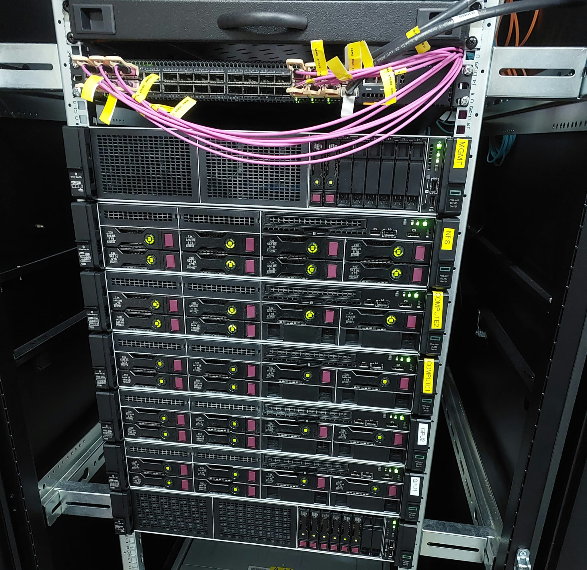
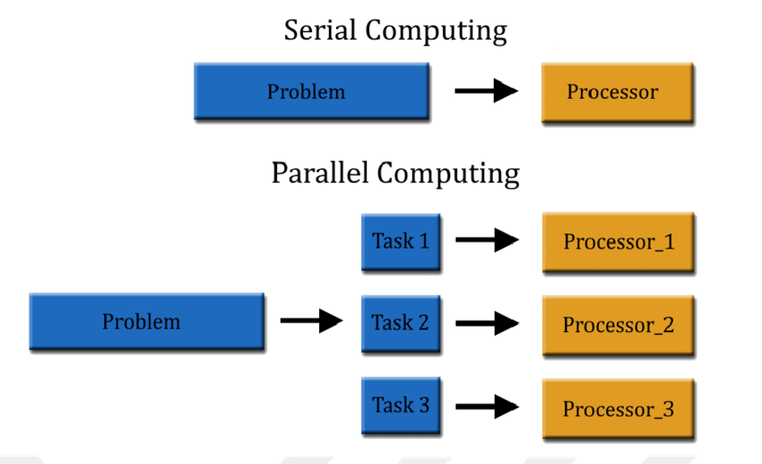
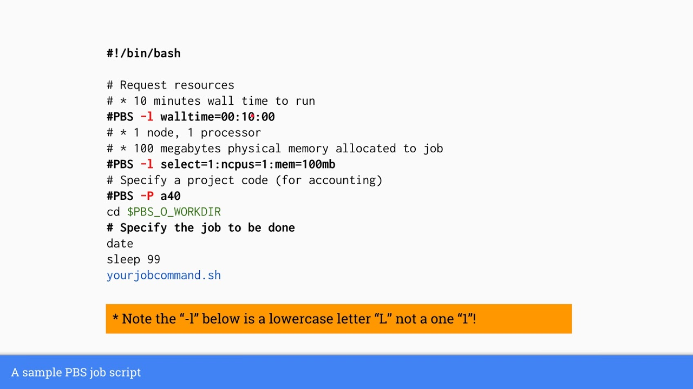

```{r xaringan-themer, include=FALSE, warning=FALSE}
library(xaringanthemer)
style_mono_accent(
  base_color = "#1c5253",
  header_font_google = google_font("Josefin Sans"),
  text_font_google   = google_font("Montserrat", "300", "300i"),
  code_font_google   = google_font("Fira Mono")
)
```

```{r xaringan-logo, echo=FALSE}
library(xaringanExtra)

xaringanExtra::use_logo(
  image_url = "./HIBIT2024.jpeg",
  position = xaringanExtra::css_position(bottom = "-2.5em", left = "1em"),
  width = "250px" # Adjust logo size as needed
)
```

# Welcome and Introduction

--

**Overview:**

--

- What HPC is and why it is essential.

--
  
- How HPC systems differ from regular computing environments.

--
  
- Applications of HPC.

--
  
- Practical demonstrations on job submission to HPC systems.

---

# What is HPC?

--

There is no clear definition!

--

Some of them are:

- Systems that combine multiple processors to perform large-scale computations.
- Computing on high performance computers
- Solving problems/doing research using computer modeling, simulation and analysis.

--

**Simply**: Solving bigger problems, faster, with better answers.

--

**How?**: Integrating many processors, memories and storage devices to act as one powerful system.

---

# Why is HPC necessary? 

**Comupter technology gets faster and better**:

--

- *Processors* are getting more powerful (Moore's Law)
- *Memory speeds* and capacities are increasing
- *Disk speeds and capacity* are also increasing

--

**However**:

- *Big simulation* problems are much bigger than any standart server can compute
- *Big Data* is too large for personal computers that can hold

---
# BIG Data & Compute Problems?
--

- Oil & Gas Industry (Seismic Sampling)
  

--

- Weather Research
  
  
--

- Particle Physics (Higgs Boson particle)
  
  
--

- Healtcare/Life Sciences (e.g. Bioinformatics)
  
  
---

# What are the components of HPC?

--

Key Components of HPC Systems:

--

**Cluster**: Group of machines interconnected each other and work together.
  - Node: Individual machine in a cluster.
  - Login/Head/Master Node: Providing user an environment to distrubute their task.
  - Compute Nodes: Used for running jobs assigned to them by head node.
  
--

**Other parts**:
  - Interconnects: High-speed networking for communication.
  - Storage: Managing massive amounts of data.

--

**How HPC Differs from Regular Computing**:
  - Performance (petaflops vs. gigaflops).
  - Scalability (handle tasks that exceed standard computer capabilities).

---

# What are the components of HPC?

--

<div style="text-align: center;">
  
</div>

---

# When do we need HPC?

**Case 1**:
  
--
  
  - Automotive Engineer
  - Need to design new car that consumes less gasoline
  - He'd rather have the desing in 6 months rather than in 2 years
  - He will test the design using computer simulations rather than building expensive prototype

--
  
**Case 2**:

--
  
  - Engineer at amazon.com
  - Their web server and databases should handle 1,000 hits per second so that customers do not experience bad delays
  - Web server and databases should be in HPC environment
  
--

**Case 3**:

--
  
  - Scientist at the Human Genome Project
  - He/she needed to process terabytes of genetic data in parallel
  - The analysis conducted in an HPC environment

---
# Top 5 Supercomputers

--
| Rank | System                                                                                                  | Cores     | Rmax (PFlop/s) | Rpeak (PFlop/s) | Power (kW) | Location                                           |
|------|---------------------------------------------------------------------------------------------------------|-----------|----------------|-----------------|------------|---------------------------------------------------|
| 1    | El Capitan | 11,039,616 | 1,742.00       | 2,746.38       | 29,581     | DOE/NNSA/LLNL, United States                     |
| 2    | Frontier | 9,066,176  | 1,353.00       | 2,055.72       | 24,607     | DOE/SC/Oak Ridge National Laboratory, United States |
| 3    | Aurora | 9,264,128  | 1,012.00       | 1,980.01       | 38,698     | DOE/SC/Argonne National Laboratory, United States |
| 4    | Eagle | 2,073,600  | 561.20         | 846.84         | N/A        | Microsoft Azure, United States                   |
| 5    | HPC6  | 3,143,520  | 477.90         | 606.97         | 8,461      | Eni S.p.A., Italy                                |
--

**Reference:** Data adapted from the latest *Top500 List* (December 2024). For more information, visit [top500.org](https://www.top500.org).

---

## How Does HPC Work?

- **Parallel Computing:** Breaking tasks into smaller problems solved concurrently.

<div style="text-align: center;">
  
</div>

--

- *Why use parallel computing?*
  - Save time and money
  - Solve larger and more complex problems

---

## How Does HPC Work?

--

- Scheduling and Resource Allocation:
  - Jobs submitted via a scheduler (e.g., SLURM, PBS).
  - Queueing and priority-based execution.
--
<div style="text-align: center;">
  
</div>

---

# Demonstration: Job Submission to HPC

```{bash, eval=FALSE}
# Connect to the server
ssh faruk@10.100.9.30

# Submit your job to PBS schedular
qsub submission.sh

# Check the status of the job
qstat
```

---

# Future of HPC and How to Get Started

--

- Trends: AI integration, quantum computing, exascale computing.

--

- Getting Started:
  - Learn basic Linux commands. 
  
  - Explore programming tools: Python, MPI, OpenMP. 
  
  - Join open-access HPC programs (e.g. PRACE). 
  
  
---

<div style="text-align: center; margin-top: 10%; margin-bottom: 10%;">
  
</div>

---

<div style="text-align: center; margin-top: 10%; margin-bottom: 10%;">
  
</div>

